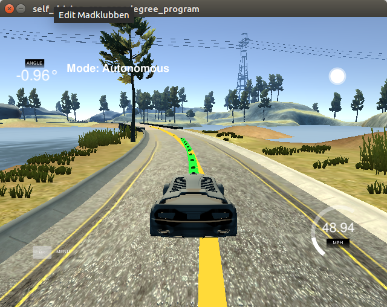

# CarND-Controls-MPC
Self-Driving Car Engineer Nanodegree Program

---



## Description
In this project, a model predictive controller (MPC) is used to automatically steer a car around a track in a car simulator.
The simulator provides the current position, velocity, and heading direction of the car, as well as waypoints along a reference trajectory, the car should follow.
Based on this, the MPC estimates actuator values (steering angle and acceleration) that respect the defined vehicle model and minimize the error between the reference trajectory and the expected trajectory.

## The Model
The vehicle model used in the project is a kinematic bicycle model.
Contrary to a dynamic model, a kinematic model does not take tire forces, gravity, and mass into consideration.
This makes the model less accurate, but considerably more tractable.

The bicycle model has 4 states, `x,y,ψ` and `v` that describe x- and y-position, heading direction, and velocity of the vehicle.
We extend these with the cross-track error `cte` and the orientation error `eψ`, which results in a total of 6 states described by the following update equations.
```
x_{​t+1} = x_​t​+v_t∗cos(ψ​t)∗dt
y_{​t+1}​​ = y_​t+v​_t∗sin(ψt)∗dt
ψ_{​t+1}​​ = ψ_​t​+​v_​t/L_f∗δ_t∗dt
v_{​t+1}​​ = v_​t​+a_​t∗dt
cte_{t+1} = f(x_t)-y_t+v_t∗sin(eψ_t)∗dt
eψ_{t+1} = ψ_t-atan(f'(x_t))+v_t/L_f∗δ_t∗dt
```
Here, `t` is the time index, `dt` is the duration between two timesteps, `L_f` is the distance between the front of the vehicle and its center of gravity, and `f` is a polynomial describing the reference trajectory of the vehicle (see Polynomial Fitting below for more details). 
`δ` and `a` are the two actuators describing respectively the steering angle and the acceleration of the vehicle.
These are the two desired parameters that we solve for, when minimizing the error terms `cte` and `eψ`. They determine how well and how fast the vehicle traverses the track.

## Timestep Length and Elapsed Duration (N & dt)
The timestep length `N` and the duration between timesteps `dt` have been chosen empirically, by starting out with the values `N=25` and `dt=0.05` provided by the solution to the "Mind The Line" problem.

These values worked pretty well with a reference/desired velocity of `v_ref=25`.
However, when increasing the reference velocity, the length of the reference trajectory (`v∗N∗dt`) becomes much larger than necessary to predict the next actuations.
In itself, this should not a problem, but as the velocity is increased, we also need faster computation time, to make the model more reactive.
And computation time depends directly on the timestep length, as `N` is also the number of variables being optimized.
I therefore came up with a simple equation to link the timestep length `N` to the reference velocity `v_ref`:
```
N = 25*25/v_ref = 625/v_ref
```
This equation makes `N` small for high velocities, ensuring fast computation time, while ensuring that the prediction horizon is the same length, regardless of the reference velocity.
As I managed to make the vehicle run with `v_ref=60`, I ended up with `N=10`.

`dt` is the duration between timesteps. Small values of `dt` provide more accurate and more continuous controls, whereas large values can lead to discretization errors.
However, as the length of the reference trajectory (prediction horizon) is proportional to `dt`, a compromise has to be found.
In my case, the initial value of `dt=0.05` was a reasonable compromise.

## Polynomial Fitting and MPC Preprocessing
As described above, the simulator provides a number of waypoints along a reference trajectory, the vehicle should follow.
These waypoints, however, are specified in global map coordinates.
As we need them in vehicle coordinates, we first transform all waypoints into the vehicle coordinate system.
Waypoint `i` with global map coordinates `x_i,y_i` is transformed into vehicle coordinates `x_i',y_i'` by first performing a translation and then a rotation:
```
// Translation
x = x_i-px
y = y_i-py
// Rotation
x_i' = x∗cos(ψ) + y∗sin(ψ);
y_i' = -x∗sin(ψ) + y∗cos(ψ);
```
where `px,py` is the global map position of the vehicle, and `ψ` is the current heading direction in the global map frame of the vehicle.

Once all waypoints are in the vehicle coordinate frame, we fit a 3rd order polynomial, describing the reference/desired trajectory of the vehicle:
```
f(x) = a_0+a_1∗x+a_2∗x^2+a_3∗x^3
```

With this defined, we can provide the initial/current state to the MPC:
```
x_0 = 0
y_0 = 0
ψ_0 = 0
cte_0 = f(x_0)-y_0 = a_0
eψ_0 = ψ_0-atan(f'(x_0)) = 0-atan(a_1+a_2*x_0+a_3*x_0^2) = -atan(a_1)
```
where `x_0,y_0,ψ_0` are all zero, since they are specified in the local vehicle coordinate frame.

## Model Predictive Control with Latency
The MPC is implemented exactly as the provided solution from Udacity to the "Mind The Line" problem.

However, to smooth the steering angle actuator, I found that multiplying the term describing the temporal differences between steering angles with a factor of 1000, provided a much better solution.
Without this factor, the vehicle experienced erratic, wobbling behaviour.

The overall cost function is therefore:
```
Cost  = sum_t[ cte_i^2 
              + eψ_i^2 
              + (v_i-v_ref)^2 
              + δ_i^2 
              + a_i^2 
              + 1000∗(δ_{i+1}-δ_i) 
              + a_{i+1}-a_i ]
```

The simulator has a 100 ms latency between actuation commands.
This means that actuations are effectively carried out 100 ms after we request them.

In the implementation, I have handled this by not returning the first actuator values (at time 0), but instead returning a later index corresponding to the latency.
As the solution to the MPC optimization problem is contained in a variable `solution.x`, the actuator values (steering and acceleration) that respect the latency of 100 ms are returned with this command:

```
return {solution.x[delta_start+int(0.1/dt)],solution.x[a_start+int(0.1/dt)]}
```
---

## Dependencies

* cmake >= 3.5
 * All OSes: [click here for installation instructions](https://cmake.org/install/)
* make >= 4.1
  * Linux: make is installed by default on most Linux distros
  * Mac: [install Xcode command line tools to get make](https://developer.apple.com/xcode/features/)
  * Windows: [Click here for installation instructions](http://gnuwin32.sourceforge.net/packages/make.htm)
* gcc/g++ >= 5.4
  * Linux: gcc / g++ is installed by default on most Linux distros
  * Mac: same deal as make - [install Xcode command line tools]((https://developer.apple.com/xcode/features/)
  * Windows: recommend using [MinGW](http://www.mingw.org/)
* [uWebSockets](https://github.com/uWebSockets/uWebSockets)
  * Run either `install-mac.sh` or `install-ubuntu.sh`.
  * If you install from source, checkout to commit `e94b6e1`, i.e.
    ```
    git clone https://github.com/uWebSockets/uWebSockets 
    cd uWebSockets
    git checkout e94b6e1
    ```
    Some function signatures have changed in v0.14.x. See [this PR](https://github.com/udacity/CarND-MPC-Project/pull/3) for more details.
* Fortran Compiler
  * Mac: `brew install gcc` (might not be required)
  * Linux: `sudo apt-get install gfortran`. Additionall you have also have to install gcc and g++, `sudo apt-get install gcc g++`. Look in [this Dockerfile](https://github.com/udacity/CarND-MPC-Quizzes/blob/master/Dockerfile) for more info.
* [Ipopt](https://projects.coin-or.org/Ipopt)
  * Mac: `brew install ipopt`
  * Linux
    * You will need a version of Ipopt 3.12.1 or higher. The version available through `apt-get` is 3.11.x. If you can get that version to work great but if not there's a script `install_ipopt.sh` that will install Ipopt. You just need to download the source from the Ipopt [releases page](https://www.coin-or.org/download/source/Ipopt/) or the [Github releases](https://github.com/coin-or/Ipopt/releases) page.
    * Then call `install_ipopt.sh` with the source directory as the first argument, ex: `bash install_ipopt.sh Ipopt-3.12.1`. 
  * Windows: TODO. If you can use the Linux subsystem and follow the Linux instructions.
* [CppAD](https://www.coin-or.org/CppAD/)
  * Mac: `brew install cppad`
  * Linux `sudo apt-get install cppad` or equivalent.
  * Windows: TODO. If you can use the Linux subsystem and follow the Linux instructions.
* [Eigen](http://eigen.tuxfamily.org/index.php?title=Main_Page). This is already part of the repo so you shouldn't have to worry about it.
* Simulator. You can download these from the [releases tab](https://github.com/udacity/self-driving-car-sim/releases).
* Not a dependency but read the [DATA.md](./DATA.md) for a description of the data sent back from the simulator.


## Basic Build Instructions


1. Clone this repo.
2. Make a build directory: `mkdir build && cd build`
3. Compile: `cmake .. && make`
4. Run it: `./mpc`.

## Tips

1. It's recommended to test the MPC on basic examples to see if your implementation behaves as desired. One possible example
is the vehicle starting offset of a straight line (reference). If the MPC implementation is correct, after some number of timesteps
(not too many) it should find and track the reference line.
2. The `lake_track_waypoints.csv` file has the waypoints of the lake track. You could use this to fit polynomials and points and see of how well your model tracks curve. NOTE: This file might be not completely in sync with the simulator so your solution should NOT depend on it.
3. For visualization this C++ [matplotlib wrapper](https://github.com/lava/matplotlib-cpp) could be helpful.

## Editor Settings

We've purposefully kept editor configuration files out of this repo in order to
keep it as simple and environment agnostic as possible. However, we recommend
using the following settings:

* indent using spaces
* set tab width to 2 spaces (keeps the matrices in source code aligned)

## Code Style

Please (do your best to) stick to [Google's C++ style guide](https://google.github.io/styleguide/cppguide.html).

## Project Instructions and Rubric

Note: regardless of the changes you make, your project must be buildable using
cmake and make!

More information is only accessible by people who are already enrolled in Term 2
of CarND. If you are enrolled, see [the project page](https://classroom.udacity.com/nanodegrees/nd013/parts/40f38239-66b6-46ec-ae68-03afd8a601c8/modules/f1820894-8322-4bb3-81aa-b26b3c6dcbaf/lessons/b1ff3be0-c904-438e-aad3-2b5379f0e0c3/concepts/1a2255a0-e23c-44cf-8d41-39b8a3c8264a)
for instructions and the project rubric.

## Hints!

* You don't have to follow this directory structure, but if you do, your work
  will span all of the .cpp files here. Keep an eye out for TODOs.

## Call for IDE Profiles Pull Requests

Help your fellow students!

We decided to create Makefiles with cmake to keep this project as platform
agnostic as possible. Similarly, we omitted IDE profiles in order to we ensure
that students don't feel pressured to use one IDE or another.

However! I'd love to help people get up and running with their IDEs of choice.
If you've created a profile for an IDE that you think other students would
appreciate, we'd love to have you add the requisite profile files and
instructions to ide_profiles/. For example if you wanted to add a VS Code
profile, you'd add:

* /ide_profiles/vscode/.vscode
* /ide_profiles/vscode/README.md

The README should explain what the profile does, how to take advantage of it,
and how to install it.

Frankly, I've never been involved in a project with multiple IDE profiles
before. I believe the best way to handle this would be to keep them out of the
repo root to avoid clutter. My expectation is that most profiles will include
instructions to copy files to a new location to get picked up by the IDE, but
that's just a guess.

One last note here: regardless of the IDE used, every submitted project must
still be compilable with cmake and make./
